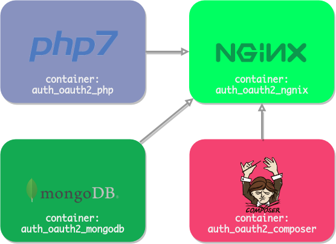

# auth-oauth2

[](https://badge.fury.io/gh/thalysonrodrigues%2Fauth-oauth2)
[](https://github.com/thalysonrodrigues/login-facebook/blob/master/LICENSE)

> Esta uma aplicação simples construída com o esqueleto de [zend-expressive](https://docs.zendframework.com/zend-expressive/) para estudo de integração de Oauth2.0 com os provedores [Facebook](https://github.com/thephpleague/oauth2-facebook) e [Google](https://github.com/thephpleague/oauth2-google). Além disto este template fornece cadastro e login de usuário e alguns middlewares da psr-15 integrados como Https, Content-Lenght, Www, Access-Log, Client-ip, para mais detalhes veja `app/composer.json`.

## Instalação

### Download (zip)

Faça download neste [link]()

### Build

Clonar este repositório
```
$ git clone https://github.com/thalysonrodrigues/auth-oauth2.git
```


## Desenvolvimento

A infraestrutura para o ambiente de desenvolvimento utiliza [Docker CE](https://docs.docker.com/install/) e [Docker Compose](https://docs.docker.com/compose/), a configuração para cada container pode ser vista em `docker-compose.yaml`. A aplicação executa através dos seguintes containers:

### Containers

* PHP7.2.5
* Nginx
* Composer
* MongoDB

<p align="center">
  <a href="https://github.com/thalysonrodrigues/containers.png">
    
  </a>
</p>

## Créditos

* Thalyson Alexandre Rodrigues de Sousa
    - [Github](https://github.com/thalysonrodrigues)
    - Email: *tha.motog@gmail.com*

## Licence

The MIT License (MIT). Please see [License File](https://github.com/thalysonrodrigues/login-facebook/blob/master/LICENSE) for more information.